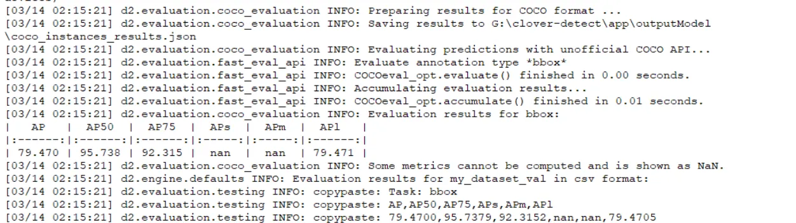
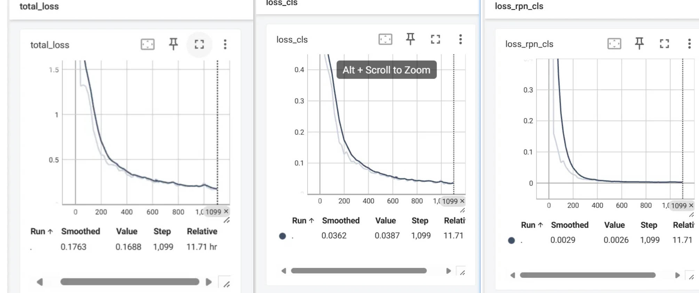
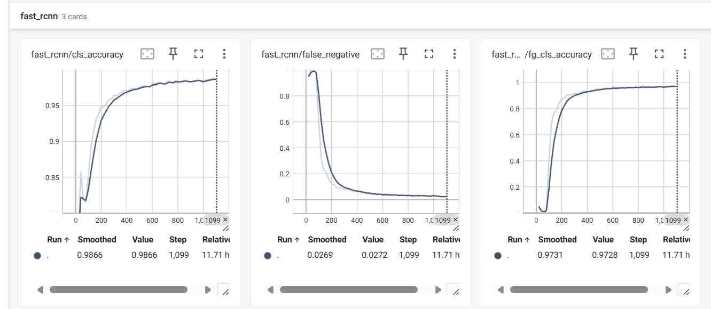
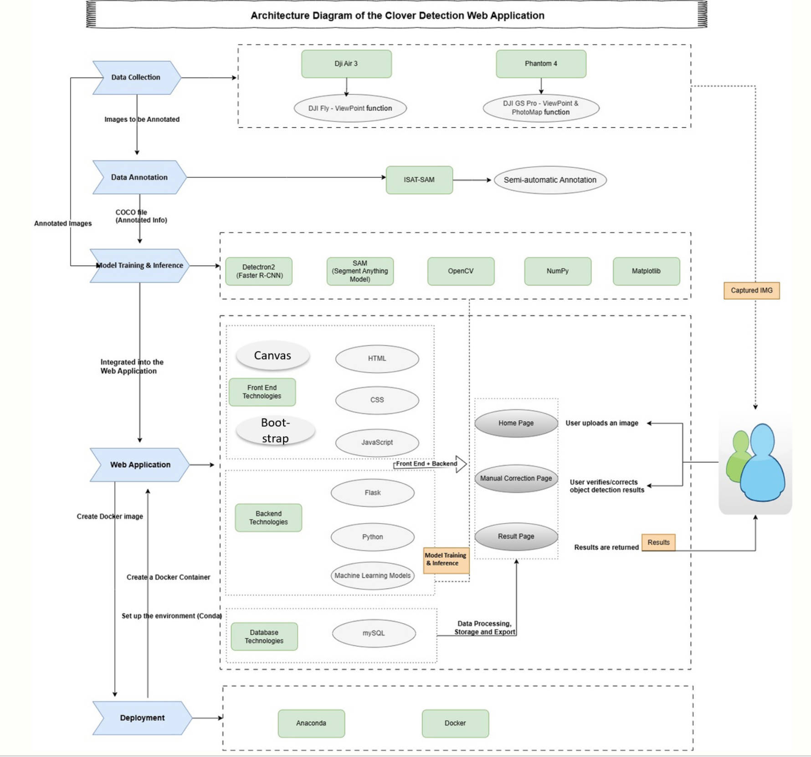
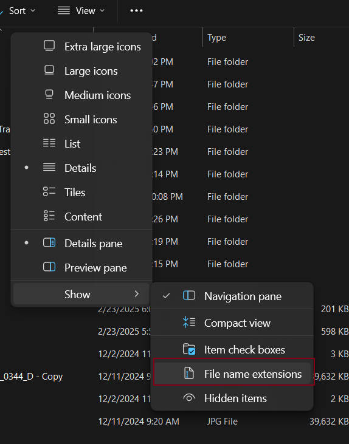
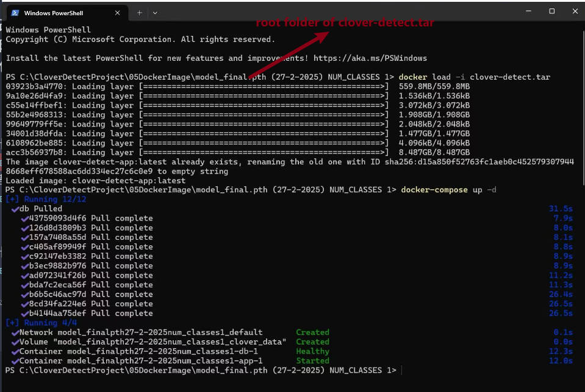
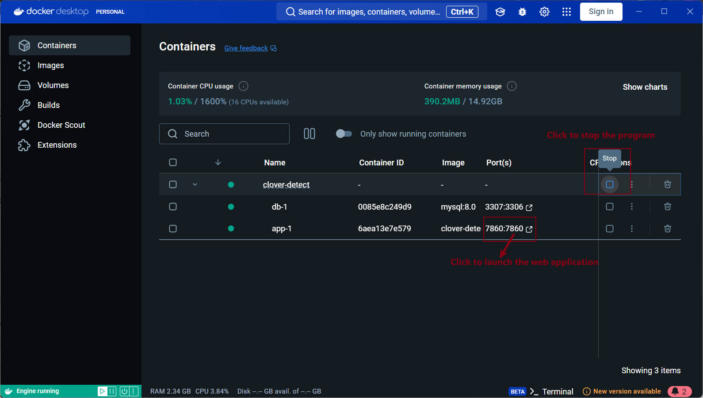

# Clover Detection and Analysis System 🌿

A web-based platform for accurate clover plot detection and coverage analysis using drone images. Powered by a custom Faster R-CNN model (Detectron2) and Segment Anything Model (SAM), this project enables precise object detection and segmentation, with a user-friendly web interface and manual correction features.

<video src="https://github.com/user-attachments/assets/4330578a-c948-4de6-80de-f461d71cdd36" controls width="720"></video>

Access the Web Interface： http://localhost:7860 (Ensure your environment is properly configured by following the setup guidelines in the **Installation** section.)

## Features ✨

- **Dual-Model Architecture**
  - Faster R-CNN (Detectron2) for initial clover plot detection
  - Segment Anything Model 2 (SAM2) for detailed segmentation
- **Interactive Correction**
  - Bounding box adjustment canvas
  - Marker-based scale calibration
  - Support flexible interactions such as zooming and dragging
- **Data Analytics**
  - Coverage and Ranking (Based on Coverage Percentage) calculations
  - Green pixel density calculation
  - Mapping of actual dimensions based on marker calibration
  - Excel report generation (XLSX)
- **Cross-Platform Deployment**
  - Docker support
  - Native installation guides (CPU & GPU versions)

## Model Performance 📊

### Training Results Overview

The custom-trained Faster R-CNN model demonstrates strong performance in clover plot detection:

| Metric | Value      | Description                       |
| ------ | ---------- | --------------------------------- |
| AP     | 79.47%     | Average Precision (IoU=0.50:0.95) |
| AP50   | **95.74%** | Average Precision at IoU=0.50     |
| AP75   | 92.32%     | Average Precision at IoU=0.75     |



### Training Dynamics & Model Robustness

#### Loss Curves

The model achieves stable and effective loss minimization, as visualized in the training curves below:


- Total Loss steadily decreases, indicating smooth convergence.
- Component Losses (loss_rpn_cls, loss_rpn_loc, loss_box_reg, loss_cls) all drop and stabilize, confirming effective learning in both region proposal and final classification stages.

#### Classification Performance:

Final Accuracy: 98.66% (cls_accuracy)
Low False Negative Rate: 2.69% - crucial for comprehensive clover detection
High Precision: 97.31% (fg_cls_accuracy) - minimizes false clover identifications


### Real-World Validation

**Robust in Diverse Field Conditions:** Tested under various lighting, seasons, and clover growth stages (including plots after mowing and post-herbicide application).


<br>

**Field Testing:** Achieved high accuracy across multiple clover field types (see the below image).


<br>

**Expert Validation:** Cross-validated results with manual expert assessments, confirming practical reliability.


## Project Architecture

Below is an overview of the end-to-end system workflow, covering data collection, annotation, model training/inference, web deployment, and user interaction:

Five key layers integrate specific tools and technologies, working together as indicated by the arrows.

## Project Structure 📂

```bash
clover-detect/
├── app/
│   ├── object_detection_and_SAM/
│   │   ├── configs/              # Model configuration YAML files
│   │   ├── weights/              # Pretrained model weights (.pth/.pt)
│   │   ├── labels/               # Label info for model training
│   │   ├── logs/                 # Event logs and metrics
│   │   ├── train.py              # Base training implementation
│   │   ├── train_augmentation.py # Augmented training pipeline
│   │   ├── inference_my_dataset.py # Custom dataset inference
│   │   ├── verify_annotation_data.py # Data validation checks
│   │   └── sam2_model_info/    # SAM v2 specifications and usage
│   ├── templates/
│   │   ├── index.html            # Main upload interface
│   │   ├── ManualCorrect.html    # Annotation correction UI
│   │   └── result.html           # Analysis results display
│   ├── static/
│   │   ├── js/                   # Interactive components
│   │   │   ├── ManualCorrect_page/ # Annotation tools
│   │   │   │   ├── base-canvas.js  # Canvas core logic
│   │   │   │   ├── bbox-manager.js # Bounding box operations
│   │   │   │   └── marker-canvas-manager.js # Marker Calibration operations
│   │   │   └── index_page/       # Home page interactions
│   │   ├── css/                  # Style sheets
│   │   └── images/               # Application image assets
│   ├── config/
│   │   ├── paths.py              # Model path configurations
│   │   ├── logging_config.py     # Log configurations
│   │   └── path_config.json      # User-customizable paths
│   ├── dbFile/
│   │   ├── config.cnf            # Database credentials
│   │   ├── schema.sql            # DB schema definition
│   │   └── database_manager.py   # Data handle functions
│   └── utils/
│       └── opencv_utils.py       # Image processing functions
│   └── data/
│       └── clover_test/          # Directory for test dataset images
│       └── clover_train/         # Directory for training dataset images
│   └── outputLogs/               # Stores application logs and training logs
│   └── outputModel/              # Stores trained model outputs
│   └── outputs/                  # Stores processed images after inference
│   └── uploads/                  # Stores uploaded images for inference
│   └── exports_excel/            # Stores Excel reports
├── docker-compose.yaml           # Docker container setup
├── Dockerfile                    # Instructions for building the Docker image
├── requirements.txt              # Python dependencies for the CPU version
├── environmentCPU.yml            # Conda environment configuration for CPU
├── environmentGPU.yml            # Conda environment configuration for GPU
└── run.cmd                       # Windows batch script to run the application
└── run.sh                        # Linux/macOS shell script to run the application
```

## Installation 🛠️

### Option 1: Docker Deployment (Recommended)

The easiest way to run the application is through Docker, which handles all dependencies and configurations automatically.

#### Prerequisites

- Install Docker Desktop
- Prepare the following files (provided in the zip package clover-detect-docker.zip):
  - clover-detect.tar (pre-built Docker image)
  - docker-compose.yaml
  - schema.sql
- Extract all files to a directory on your computer

**Important Note**: If you cannot find the `clover-detect.tar` file, make sure file extensions are visible in your file explorer settings.


#### Setup and Run

1. Run Docker Desktop APP
2. Navigate to the directory containing the files
3. Open a terminal(PowerShell or Bash) and enter the following commands to build and run the Docker container:

```bash
# Load the pre-built image (it takes time)
docker load -i clover-detect.tar

# Start the application using docker-compose
docker-compose up -d
```



After the initial setup, you can access the application through typing the address into the browser's navigation bar with: http://localhost:7860 or simply use the Docker Desktop to start or close the container. If you accidentally delete the container, re-enter the above commands to rebuild it. ( It a bit takes time for the web page to first load)



#### Cleaning Up Docker Resources

When you're done using the application:

1. Stop the container using Docker Desktop or with:

   ```bash
   docker-compose down
   ```

2. To thoroughly remove all associated resources (images, volumes, and networks):
   ```bash
   docker system prune -a --volumes
   ```

**Note**: Simply clicking the "Delete" button in Docker Desktop may not completely remove all resources. The command above ensures complete cleanup.

### Option 2: Local Development

For continued development or model training, setting up a local environment is recommended.

#### Prerequisites

- Python 3.10
- Git
- Conda (Miniconda or Anaconda)
- CUDA 11.7+ (for GPU version only)

#### Setup Steps

1. **Extract the Project**

   ```bash
   # If using the ZIP package:
   unzip clover-detect.zip -d clover-detect
   cd clover-detect
   ```

2. **Create Environment Using Conda**

   ```bash
   # For CPU version
   conda env create -f environmentCPU.yml

   # For GPU version
   conda env create -f environmentGPU.yml
   ```

3. **Activate the Environment**

   ```bash
   # For CPU version
   conda activate CloverCPU

   # For GPU version
   conda activate Clover
   ```

4. **Install SAM2 from Local Directory**
   Installing from the local folder ensures project structure and path configurations remain consistent, preventing configuration file errors.

   ```bash
   cd app/object_detection_and_SAM/sam2_model_info/sam2
   pip install -e .
   cd ../../../../
   ```

5. **Run the Application**

   ```bash

   # Windows
   ./run.cmd

   # Linux/macOS
   ./run.sh

   # Or directly with Flask
   python -m flask run --host=0.0.0.0 --port=7860
   ```

## Configuration ⚙️

1. **Model Paths** (`app/config/paths.py`)
   Model paths are all configured in `app/config/paths.py`. The default configuration should work if you're using the provided unzipped project structure:

```python
FASTER_RCNN_WEIGHTS = "app/object_detection_and_SAM/weights/model_0001099.pth"
SAM_WEIGHTS = "app\object_detection_and_SAM\sam2_model_info\sam2\checkpoints\sam2.1_hiera_large.pt"
SAM2_CONFIG = "app/object_detection_and_SAM\sam2_model_info\sam2\sam2\sam2.1_hiera_l.yaml"
```

2. **Database Setup** (`app/dbFile/config.cnf`)

When running locally, you need to set up a local MySQL server.

```ini
[database]
host=localhost
user=your_username
password=your_password
database=your_db_name
```

## Usage Guide 🚀

**Web Interface Workflow**

1. Upload pasture image (JPG/JPEG)
2. Review detected clover plots
3. Adjust bounding boxes if needed
4. Add calibration marker (optional)
5. Submit for SAM2 analysis
6. View results: hover to quickly locate the corresponding plot in the image
7. Export results by click "Export CSV"

#### Data storage Path Configuration

Configure persistent storage paths for your data:

For local environments: After setting up your local environment, you can access path settings through the "Paths" button in the top-right corner of the Index (home) page to modify local storage paths.

The Docker environment defaults to Windows as the host operating system and mounts the corresponding folders in C:/CloverData. If using macOS or Linux, modify the docker-compose.yaml file as shown below, then rebuild and run the Docker container.

| OS      | Default Path               | Configuration Method                    |
| ------- | -------------------------- | --------------------------------------- |
| Windows | `C:\CloverData`            | Default settings in docker-compose.yaml |
| macOS   | `/Users/Shared/CloverData` | Edit docker-compose.yaml                |
| Linux   | `/data/CloverData`         | Edit docker-compose.yaml                |

To modify the paths for macOS or Linux, edit the volume mappings in `docker-compose.yaml`:

```yaml
volumes:
  # For Windows (default)
  - C:/CloverData/uploads:/app/uploads
  - C:/CloverData/outputs:/app/outputs
  - C:/CloverData/exports_excel:/app/exports_excel

  # For macOS (uncomment and comment Windows paths)
  # - /Users/Shared/CloverData/uploads:/app/uploads
  # - /Users/Shared/CloverData/outputs:/app/outputs
  # - /Users/Shared/CloverData/exports_excel:/app/exports_excel

  # For Linux (uncomment and comment Windows paths)
  # - /data/CloverData/uploads:/app/uploads
  # - /data/CloverData/outputs:/app/outputs
  # - /data/CloverData/exports_excel:/app/exports_excel
```

Apply the changes by following these steps:

```bash
docker-compose down  # Stop and remove the existing containers
docker-compose up --build -d  # Rebuild and start the container with updated volume mappings
```

Key benefits:

- Data persists beyond container lifecycle
- Direct host filesystem access
- Better I/O performance

## Model Training 🧠

To train or fine-tune the models on new dataset:

| Script            | Command                                                     | Description                                                                                                                                   |
| ----------------- | ----------------------------------------------------------- | --------------------------------------------------------------------------------------------------------------------------------------------- |
| Base Training     | `python app/object_detection_and_SAM/train.py`              | CPU-friendly basic training                                                                                                                   |
| Enhanced Training | `python app/object_detection_and_SAM/train_augmentation.py` | Requires higher GPU performance but leverages OpenCV to expand the sample size, improving model generalization and reducing overfitting risk. |

## Troubleshooting 🔧

| Issue                                                                    | Solution                                                                                                                                     |
| ------------------------------------------------------------------------ | -------------------------------------------------------------------------------------------------------------------------------------------- |
| Docker container won't start                                             | Check Docker logs: `docker logs clover-detect`                                                                                               |
| Model loading errors                                                     | Verify weights exist in the correct paths                                                                                                    |
| Database connection failures                                             | Check `app/dbFile/config.cnf` and ensure MySQL is running                                                                                    |
| CUDA out of memory                                                       | Reduce image size or use CPU version                                                                                                         |
| SAM2 import errors                                                       | Ensure SAM2 checkpoints and weight exist in the correct paths                                                                                |
| Database table error (e.g., "Table 'CloverDetect.images' doesn't exist") | Run `docker-compose down -v` to remove the database persistent volume, then restart with `docker-compose up -d` to reinitialize the database |
| Path inconsistencies                                                     | Make sure file paths in configuration match your actual directory structure                                                                  |
